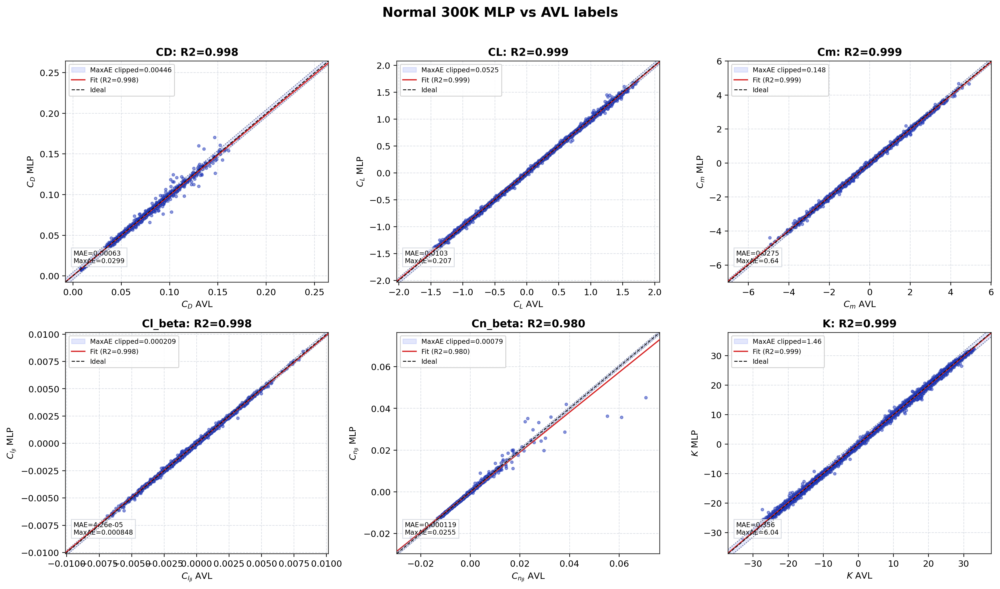
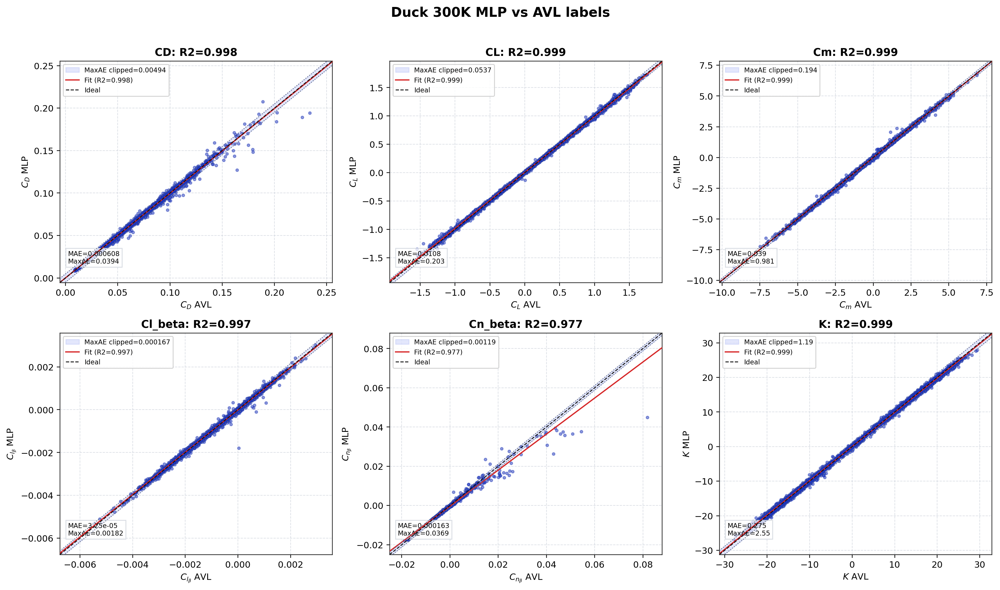

# Original12 Aero MLP 300k Training Database

This repository packages the 300k-case aerodynamic MLP training workflow for the
Original12 aircraft optimization studies.

It includes:

- compact 300k aerodynamic database export in `data/`
- dataset-generation, AVL-labeling, trainset-preparation, training, benchmark,
  and plotting scripts in `src/` and `scripts/`
- trained 300k MLP model bundles in `models/`
- R2, MAE, RMSE, history, and correlation artifacts in `analysis/`
- six-output prediction comparison figures in `figures/`

## Dataset

Committed database artifact:

`data/aero_300k_hard40k_khead_export.zip`

The export contains:

- input matrix: `(300000, 20)`
- output matrix: `(300000, 6)`
- combined matrix: `(300000, 26)`
- column order files

Input columns:

`f_aspect, f_sweep, f_taper, f_twist, a_aspect, a_sweep, a_taper, a_twist, a_x_loc, a_S_rel, v_aspect, v_S_rel, scheme_fuse, scheme_vertical, a_dihedral_mag, S_ref, V, H, alpha, delta`

Output columns:

`cx, cy, mz_ref, mx_beta, my_beta, K`

The source raw CSV `aero_labeled_v2_300k_hard40k_khead.csv` is not committed
because it is above GitHub's normal 100 MB per-file limit. See
`DATA_MANIFEST.md`.

## Model Bundles

The trained model directories are:

- `models/aero_mlp_original12_common_qkhead_300k_hard40k`
- `models/aero_mlp_original12_normal_qkhead_300k_hard40k`
- `models/aero_mlp_original12_duck_qkhead_300k_hard40k`

Each bundle contains promoted Keras checkpoints, scalers, `metrics.json`,
training history, validation history, test predictions, and correlation tables.

## Test Metrics

Summary from `analysis/300k_model_metrics_20260618`:

| Model | Mean R2 | Mean MAE | Max MAE |
| --- | ---: | ---: | ---: |
| common | 0.994919 | 0.065084 | 0.341074 |
| normal | 0.995605 | 0.065763 | 0.355903 |
| duck | 0.994789 | 0.054216 | 0.274771 |

Selected per-output test metrics:

| Model | Output | R2 test | MAE test |
| --- | --- | ---: | ---: |
| common | cx | 0.997889 | 0.000622 |
| common | cy | 0.999477 | 0.010218 |
| common | mz_ref | 0.998447 | 0.038402 |
| common | K | 0.999252 | 0.341074 |
| normal | cx | 0.997747 | 0.000630 |
| normal | cy | 0.999481 | 0.010345 |
| normal | mz_ref | 0.998826 | 0.027540 |
| normal | K | 0.999285 | 0.355903 |
| duck | cx | 0.997505 | 0.000608 |
| duck | cy | 0.999361 | 0.010768 |
| duck | mz_ref | 0.998895 | 0.038952 |
| duck | K | 0.999419 | 0.274771 |

MAE values are in the native units of each aerodynamic output; do not average
MAE across outputs as a physical score.

## Reproduction Workflow

The practical workflow is:

1. Generate LHS or targeted geometry/aero cases:
   - `src/generate_aero_lhs_v2.py`
   - `src/generate_aero_lhs_targeted_hard40k_v2.py`
2. Label cases with AVL:
   - `src/label_aero_avl_v2.py`
3. Merge/split and prepare trainsets:
   - `src/merge_aero_labeled_v2.py`
   - `src/split_aero_labeled_normal_duck_v2.py`
   - `src/prepare_aero_trainset_v2.py`
4. Train MLP models:
   - `src/train_aero_mlp_v2.py`
5. Export compact NPY database:
   - `src/export_aero_300k_npy.py`
6. Benchmark and plot:
   - `src/benchmark_single_model_variants_v2.py`
   - `src/benchmark_split_model_variants_v2.py`
   - `src/plot_topview_mlp300k_vs_original_avl_best.py`

Batch entry points are in `scripts/`, especially:

- `scripts/run_retrain_hard40k_split_then_optimize_cy06.bat`
- `scripts/run_retrain_qmission_260k_khead_common_split_cy06.bat`

## Figures

Six-output test-set comparison figures:

- `figures/comparison_6_outputs_normal_300k.png`
- `figures/comparison_6_outputs_duck_300k.png`

## Provenance

Source portable folder used to assemble this repository:

`D:\OptimizationNewMLP\OptimizationNewMLP_mlp_original12_qmission_260k_khead_common_split_targeted30k_portable`

Metric source:

`D:\OptimizationNewMLP\analysis_300k_model_metrics_20260618`
